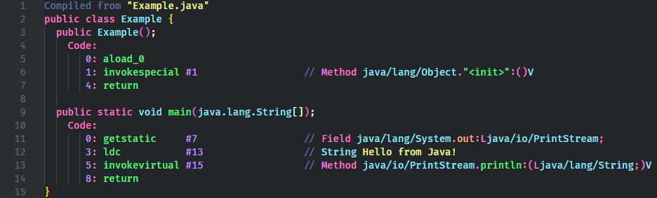
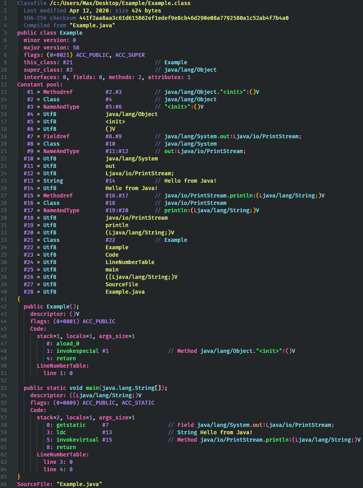

# JVM Bytecode Viewer

An extension that shows the JVM Bytecode for a given `.class` file.

This extension uses the `javap` program that comes with the Java JDK; make sure it is accessible from the `PATH` environmental variable.

The bytecode output windows are automatically updated when the `.class` file is changed on disk.

## Usage

First open a compiled `.class` file, then do one of the following:

- Click the `Show JVM Bytecode` in the title bar.
- Hold `alt` and click the `Show JVM Bytecode (Verbose)` button in the title bar.
- Right-click the file in the title bar and click `Show JVM Bytecode` or `Show JVM Bytecode (Verbose)`.
- Right-click the file in the explorer and click `Show JVM Bytecode` or `Show JVM Bytecode (Verbose)`.

To show the bytecode of a `.class` file that is inside a `jar`, you must first open the jar file. To open the Jar file:

- Click the `Explore Jar File` in the title bar.
- Right-click the file in the title bar and click `Explore Jar File`.
- Right-click the file in the explorer and click `Explore Jar File`.

The contents of the Jar file will be shown in a tree view titled `Jar Explorer` in the side panel.

The Jar file can be closed by right-clicking the Jar file in the `Jar Explorer` and clicking `Close Jar File`

## Configuration

| Option                                          | Description                                                      | Default |
| ----------------------------------------------- | ---------------------------------------------------------------- | ------- |
| `jvm-bytecode-viewer.defaultToVerboseOutput`    | Whether the title bar button opens the verbose output by default | `false` |
| `jvm-bytecode-viewer.editorTitleBar`            | Whether to show commands in the editor title bar menu            | `true`  |
| `jvm-bytecode-viewer.editorTitleBarContextMenu` | Whether to show commands in the editor title bar context menu    | `true`  |
| `jvm-bytecode-viewer.explorerContextMenu`       | Whether to show commands in the explorer context menu            | `true`  |

## Examples

### Normal

### Verbose

(VSCode Color Theme Used: [Golden Dracula](https://github.com/mnxn/Golden-Dracula))

## Notes

- This extension was tested with the JDK 14 version of `javap`.
- The verbose output of `javap` is significantly more complicated than the normal output so there may be some inconsistencies with its highlighting.
- If you see highlighting that you think is incorrect, please [submit an issue](https://github.com/mnxn/vscode-jvm-bytecode-viewer/issues/new) with a screenshot.
- The Jar exploration code was adapted from https://github.com/stef-levesque/vscode-zipexplorer
